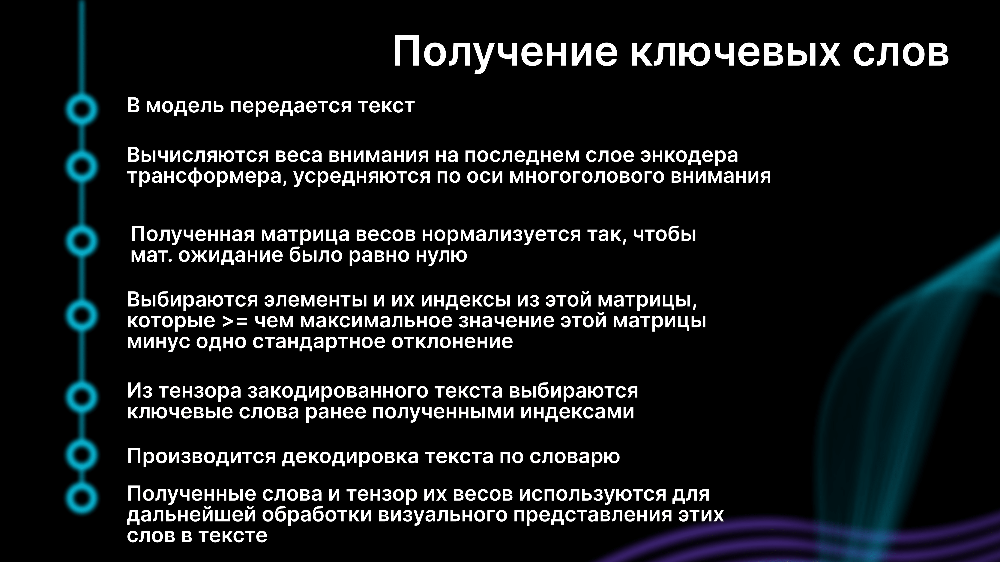

## Всероссийский хакатон Цифровой прорыв: сезон ИИ. Кейс ЦБ РФ "Анализатор текстовых пресс-релизов"
Был дан датасет с текстовыми пресс релизами РКА.  
По ходу решения было выявлено две задачи:
1) создание классификатора на два таргета (на 7 и 17 классов, для укрупненного и детализированного рейтинга соответственно).  
2) создание механизма для выделения ключевых слов в тексте, которые указывают на принадлежность.
  
Зная, что ЦБ - это организация с очень высоким контролем безопасности мы решили не использовать предобученные модели.  
Поэтому мы написали свой transformer - encoder с нуля и обучили его только на том датасете, что представили организаторы.  
Также для взаимодействия с нашим решением был создан веб-интерфейс.
Вот презентация нашего решения:

